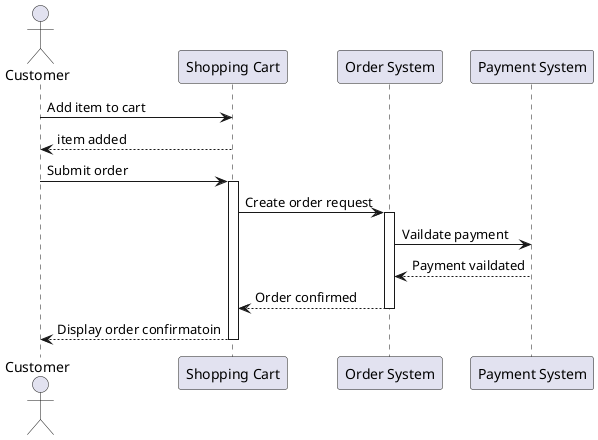

# Coffee POS System
> This project is online course demo, it's about cofee shop POS system


### how to run 
```bash
run Main.java
```

#### MySQL in docker
```bash
$ docker run --name some-mysql -e MYSQL_ROOT_PASSWORD=my-secret-pw -d mysql
```

* sql: Store all sql files for history
* model: object mapping for db schema test
* dao: handle db connect and process sql
* service: handle business logic and flow

