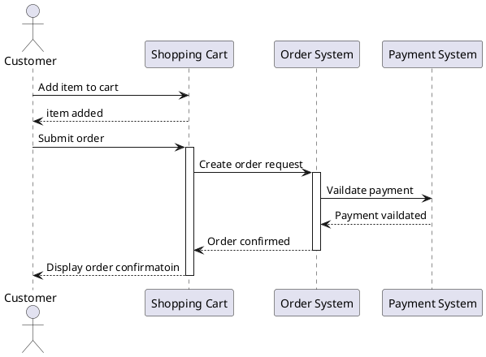

# Coffee POS System
> This project is online course demo, it's about cofee shop POS system


### how to run 
```bash
run Main.java
```

#### MySQL in docker
```bash
$ docker run --name some-mysql -e MYSQL_ROOT_PASSWORD=my-secret-pw -d mysql
```

* sql: Store all sql files for history
* model: object mapping for db schema test
* dao: handle db connect and process sql
* service: handle business logic and flow



[](https://editor.plantuml.com/uml/RP4xRiD034HxdO9mhmkeC1p8VG88I4-BZ4D0-yakPK2tp_uKsqcwrV0DEGETecBGrImTpke2Z6jKPpXqFiaoYqUhS9W-dVTYhp0czG0Oo-EPUGt40QOjAfk25E6PUSFDS7eyK4tgklqozCUoVO0N8f34WJgOyxqiGv_dZHtA68cO_l5FwyM8WYl1SZ-veNADNbSTQyW1ni1vLD70Noj7lJjgaremULha0TvH5ig0RoNsVlrzyoxT6alxdf-OzNjszaE2INFYNuV_reQpHB_WrW8tBweJ-sWlJKziAV_VRm00)